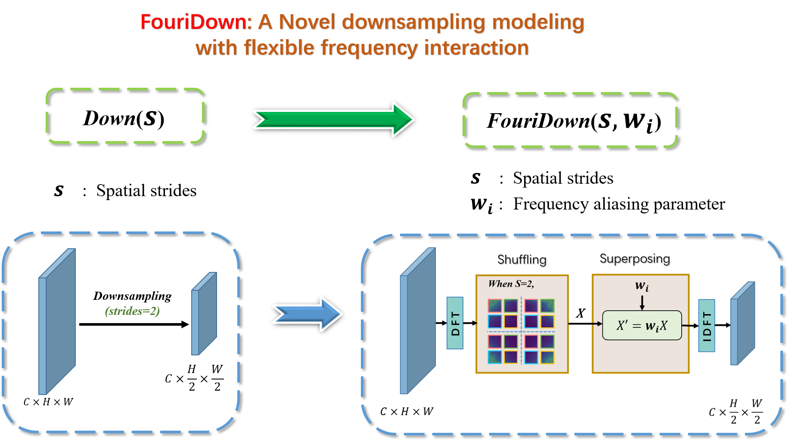
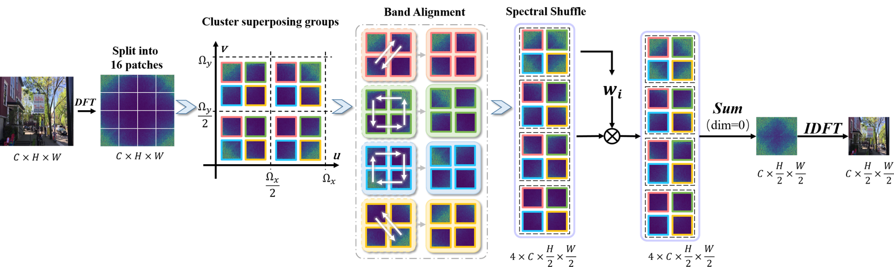
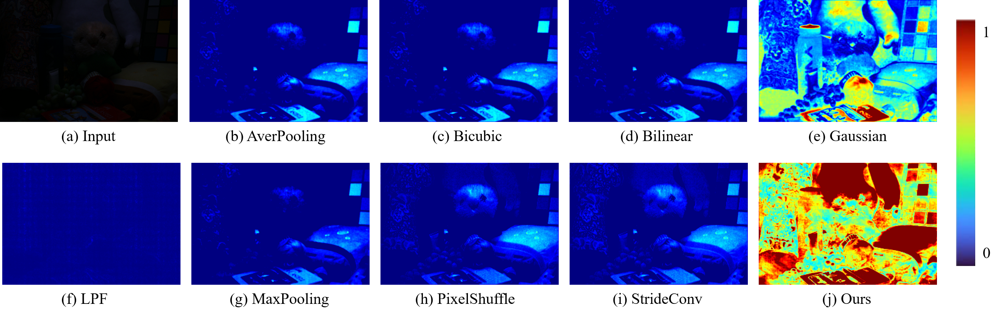
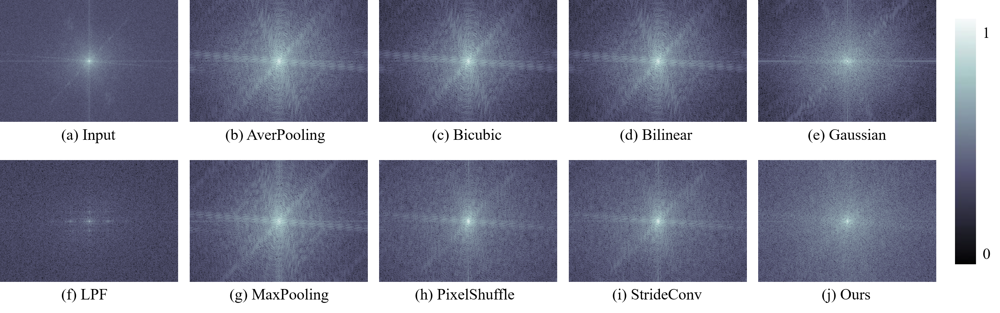

# FouriDown: Factoring Down-Sampling into Shuffling and Superposing (NeurIPS 2023)

FouriDown, as a generic operator, comprises four key components: 2D discrete Fourier transform, context shuffling rules, Fourier weighting-adaptively superposing rules, and 2D inverse Fourier transform. These components can be easily integrated into existing image restoration networks.

html 

></img>

## Framework
</img>

## Feature Visualization
</img>

## Feature Spectrum Visualization
</img>

